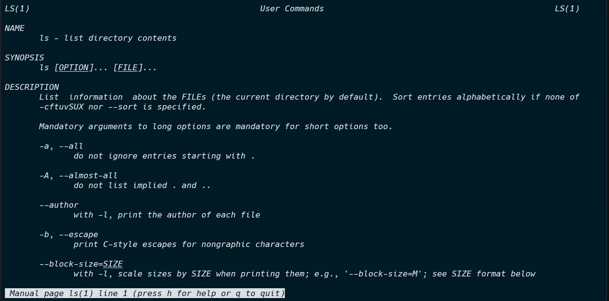

# The Command Line

Find all the info you need in the man-pages. Make sure to comment the commands you used to find this information. Try to solve the challenges without making use of the Internet.

Mark challenges using a ✅ once they are finished.

## ✅ The man command
//*Describe in your own words what the `man` command does.*

the `man` command stands for the **"user manual"** and gives you general information about any command that is passed with the command.
the `man` command is to be used in combination with any another command.
to help you understand what the command does and what options are available for the command you are trying to understand.

### for example: *ask the user manual for the ls command*
```sh
[user@linux][~]$ man ls
```
### output


## ✅ The whoami command
//*Describe in your own words what the `whoami` command does.*

the `whoami` command show's the user the linux user that is currently logged in at that time.
### for example: 
```sh
[user@linux][~]$ whoami
```
### output
```
user
```

## ✅ The uptime command
//*Describe in your own words what the `uptime` command does.*

the `uptime` command show's what time it is and how much time has passed from when the system was booted.
### for example: 
```sh
[user@linux][~]$ uptime
```
### output
```
16:52:37 up 28 min,  0 users,  load average: 0.00, 0.00, 0.00
```

## ✅ Help on ls
//*`ls` can be used to list the files and directories in Linux. If you execute the command `ls -h` you do not get any help about the command. How come? What does `ls -h` actually do?*

the `ls -h` command shows all the not hidden files of the root folder of the system.
>to get the actual help for the `ls` command you should use `ls --help`.

## ✅ Hidden files
//*Linux harbors some hidden files which are not automatically listed when executing `ls`. Find out how to list hidden files. How can we recognize hidden files?*

to list all hidden files you can use `ls -a` or `ls --all`.
>we can recognize hidden files on the fact that they have a `.` in front of there name.

## ✅ Special Directories
//*What do the following symbols refer to when used for example with `ls`?*

* **`~`**: refers to the home directory
* **`.`**: refers to the current directory
* **`..`**: refers to the parent directory
* **`/`**: refers to the root directory

## ✅ What shells are available
//*Check the Internet on how you can get a list of all available shells on your system.*

to list all available shells on your system you can use the `cat` command that will show the shells file in the terminal window.
### code example use `cat` /etc/shells: 
```sh
[user@linux][~]$ cat /etc/shells
```
### output
```
# /etc/shells: valid login shells
/bin/sh
/bin/bash
/usr/bin/bash
/bin/rbash
/usr/bin/rbash
/bin/dash
/usr/bin/dash
/usr/bin/tmux
/usr/bin/screen
```

## ✅ What date is it
//*How would you request the current date and time via the terminal?*

too request the current date and time you can use the `date` command.
### code example `date` : 
```sh
[user@linux][~]$ date
```
### output
```
Sun Oct  2 17:25:12 CEST 2022
```