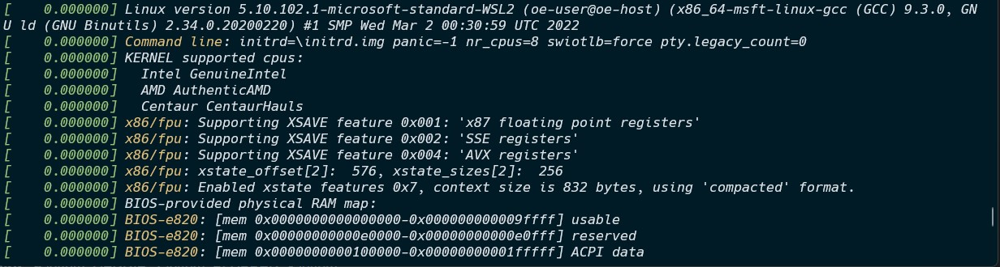

# Getting Help

Find all the info you need in the man-pages. Make sure to comment the commands you used to find this information. Try to solve the challenges without making use of the Internet.

Mark challenges using a ✅ once they are finished.

## ✅ The free command
//*Describe in your own words what the `free` command does. Give an example and a partial output.*

the `free` command shows you how much free and used memory of the system.
### example usage:
```sh
[user@linux][~]$ free
```
### output:
```
              total        used        free      shared  buff/cache   available
Mem:       16340008      266108    15932920         292      140980    15838756
Swap:       4194304           0     4194304
```

## ✅ The id command
//*Describe in your own words what the `id` command does. Give an example and a partial output.*

the `id` command shows you the id of the user and the groups printed in the terminal. 
### example usage:
```sh
[user@linux][~]$ id
```
### output:
```
uid=1000(user) gid=1000(user) groups=1000(user),4(adm),20(dialout),24(cdrom),25(floppy),27(sudo),...
```
## ✅ The tree command
//*Describe in your own words what the `tree` command does. How do you list all subdirectories too? How can you only include directories? If the `tree` command is not available on your system you can install it using `sudo apt install tree`*

the `tree` command shows you the a tree structure of the **current directory's** not hidden files and directories in the terminal.
too see all the directories and files you can use the `tree -a` command 
and to only include directories you can use the `tree -d` command.

## ✅ The which command
//*Describe in your own words what the `which` command does. What is the result for `pwd` ?*

the `which` command is used to find the location of the executable file or the location of a program in the file system.
```sh
[user@linux][~]$ which pwd
```
### output:
```
/usr/bin/pwd
```
## ✅ The file command
//*Describe in your own words what the `file` command does. What is the result for `~/.bashrc` ?*

the `file` command is used to determine the type of data in that particular file but not the extension type.
```sh
[user@linux][~]$ file ~/.bashrc
```
### output:
```
/home/user/.bashrc: ASCII text
```
## ✅ The type command
//*Describe in your own words what the `type` command does. What is the result for `ls` and what is the result for `g++` ?*

the `type` command is used to get a description of the command variables if used as a command. It can also be used to find if it was a build-in command or a external binary file.
### for ls:
```sh
[user@linux][~]$ type ls
```
### output ls:
```
ls is aliased to `ls --color=auto'
```
### for g++ :
```sh
[user@linux][~]$ type g++
```
### output g++ :
```
g++ is /usr/bin/g++
```
## ✅ Counting lines and words
//*What command can be used to count lines and words in text? Give an example and explain the output.*

the `wc` command can be used to count lines "`-l`" and words "`-w`" and bytes "`-c`" of a certain file.

### for example:
```sh
[user@linux][~]$ wc -l ./hushlogin
```
### output:
```
0 ./hushlogin
```
the 0 in the output is the amount of lines in this certain file.

## ✅ The wget command
//*How can you download a file from the Internet using the command line?. Find a file online to use it on and demonstrate its usage.*

the `wget` command can be used to download a file from the Internet when given the url of the file you want to download.
### for example:
```sh
[user@linux][~]$ wget https://4.bp.blogspot.com/-W0_HZx9NWfI/XD45qcBbaII/AAAAAAAAAn4/paWYCWR06l092c0vcBV2G9HAChXB3nhRwCKgBGAs/w3840-h2400-c/astronaut-space-13-4k.jpg
```
### output:
```
--2022-10-02 19:08:45--  https://4.bp.blogspot.com/-W0_HZx9NWfI/XD45qcBbaII/AAAAAAAAAn4/paWYCWR06l092c0vcBV2G9HAChXB3nhRwCKgBGAs/w3840-h2400-c/astronaut-space-13-4k.jpg
Resolving 4.bp.blogspot.com (4.bp.blogspot.com)... 216.58.214.1, 2a00:1450:400e:800::2001
Connecting to 4.bp.blogspot.com (4.bp.blogspot.com)|216.58.214.1|:443... connected.
HTTP request sent, awaiting response... 200 OK
Length: 1651611 (1.6M) [image/jpeg]
Saving to: ‘astronaut-space-13-4k.jpg’

astronaut-space-13-4k.jpg     100%[=================================================>]   1.57M  8.10MB/s    in 0.2s

2022-10-02 19:08:46 (8.10 MB/s) - ‘astronaut-space-13-4k.jpg’ saved [1651611/1651611]
```

## ✅ The dmesg command
//*Describe in your own words what the `dmesg` command does. Give an example and a partial output.*

the `dmesg` command shows you the info stored in the kernel ring buffer. It is most useful when troubleshooting hardware-related errors.
### for example:
```sh
[user@linux][~]$ dmesg
```
### output:


## ❌ Checksums

*Go to the website of Raspberry Pi - [https://www.raspberrypi.org/software/operating-systems](https://www.raspberrypi.org/software/operating-systems) and download the Raspberry Pi OS image using the `wget` command line tool. Now check if the SHA-256 checksum complies with the one being advertised on the website.*

*What tool did you use to calculate the checksum? Demonstrate its usage.*

*What is the use of this hash?*

## ❌ The printenv command

*Describe in your own words what the `printenv` command does.*

## ❌ IP Address

*Find the IP address of your WiFi interface. What command did you use?*

## ❌ IP of Redmine Server

*What is the IP address of the server `project.devbit.be`?*

## ❌ The nslookup command

*Describe in your own words what the `nslookup` command does.*
